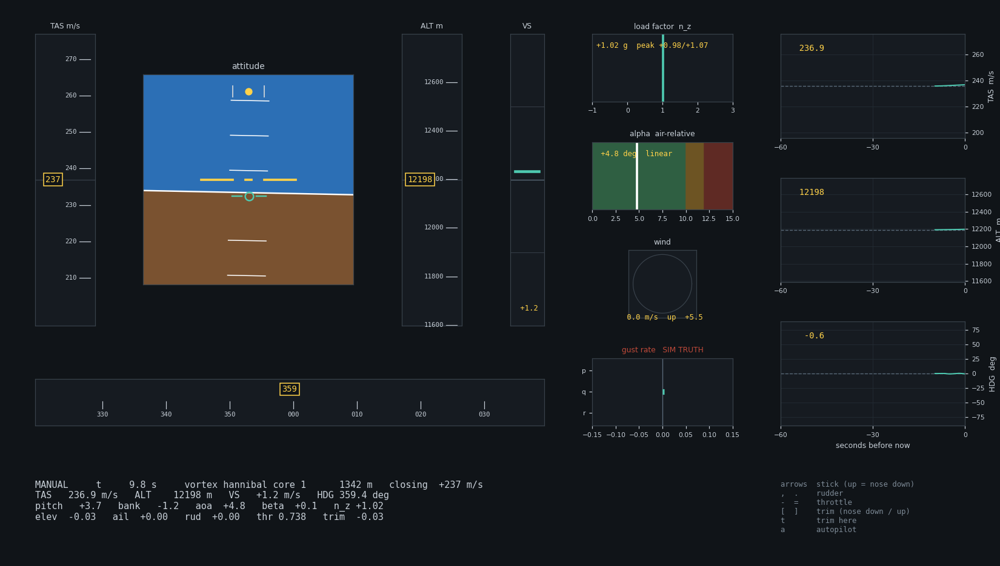

# AtiSim ✈️

**A Flight dynamics simulator focused on CAT**



---

## The pitch

Six degrees of freedom, quaternions, RK4, all of it JIT-compiled and vectorised Validated by taking real 
CAT encounters out of old NASA papers rebuilding the wind field, and comparing the models response to 
the real measured aircraft response.

## Try it

```bash
git clone https://github.com/MatusGib/Atisim.git && cd Atisim
python -m venv .venv
.venv/Scripts/python.exe -m pip install -e .
```

Four dependencies. `jax`, `numpy`, `scipy`, `matplotlib`. That's the whole runtime.
(++ — `.[dev]` for tests, `.[ui]` for the Dash app, `.[ref]` for comparisons with JSBSim) 

**Basic Sanity Checks:**

```bash
.venv/Scripts/python.exe scripts/sanity.py
```

Twelve basic tests. Zero the wind, does it fly straight?
Zero a coefficient so a motion becomes physically impossible, does the motion stop? Then
signs, then numbers I worked out by hand and printed next to the model's answer so you can
just... look at them. This is the "why should I believe any of this" script.

**Then go fly it:**

```bash
.venv/Scripts/python.exe scripts/fly.py --aircraft cherokee
```

Arrow keys are the stick (up is stick *forward*, so up pitches you *down* — it's a stick,
not a mouse). `,` `.` rudder. `-` `=` throttle. `[` `]` trim. `a` gives up and hands it to
the autopilot.

**If you want to fly it into a vortex:**

```bash
.venv/Scripts/python.exe scripts/fly.py --wind hannibal
```

That's the vortex array from the Hannibal, Missouri encounter. Good luck :)

## The actually-interesting bit

```bash
.venv/Scripts/python.exe scripts/vortex.py --case hannibal --png runs/v.png
```

Mehta 1987 identified a five-vortex field from a real DC-10 encounter. I rebuilt it and
flew my 747 through:

- gust peak lands on **−86.8 ft/s**, which is exactly the `V₀` the paper identified — that's
  the Rankine core signature falling out on its own, I didn't tune it
- load factor **−0.398 to +1.441 g** against the recorded **−1.0 to +1.7 g**. Inside the
  band, about two thirds of the way across it
- σ_n of **0.64 g**, where "severe" starts at 0.3


## Limitations (for now :) )

**This is a comparative tool, not a load calculator.** It'll tell you *which* encounter is
worse and *why*, and it'll get the ordering right. It will not tell you "the load will be
2.3 g." Absolute agreement is structurally out of reach, eg. I'm comparing a 747 to a DC-10 at
0.8× the wing loading for one of the tests. I also have some smaller aircrafts but they are not very accurate 
more as a fun thing to fy.

It's only validated for:

- 747-class transports, Mach 0.70–0.90, 35–45k ft
- 737 validated at cruise using JSBsim
- |α| under about 10° — **there is no stall in the aero model**, it'll happily fly you to 40°
  and report nonsense with a straight face
- gusts bigger than ~3 wingspans
- longitudinal response. Lateral fields exist now, lateral *validation* doesn't
  


## References

Every number in this repo has a paper behind it. `provenance.py` tracks whether a constant
was SOURCED, DERIVED, CALIBRATED or just DECLARED, and there's a test that won't let a
derived value point at something that doesn't exist. `docs/ASSUMPTIONS.md` is everything I
*assumed*; `docs/PROJECT.md` is everything I *measured*, and I supersede rows rather than
delete them so I can't quietly lose an inconvenient result.

 `predictions.py` I wrote down what I think would happen *before* some runs then use it 
 as a bit check to see if results are resonable


**811 tests, ~12 minutes:**
(I asked claude to add test make sure the code works...)

```bash
.venv/Scripts/python.exe -m pytest -q
```

## There's a UI too

```bash
.venv/Scripts/python.exe -m atisim.apps.sweep runs/analysis
```

Dash app. Click anywhere on a time series and every other panel — including the 3D wind
field with the trajectory threaded through it — jumps to that same instant. Useful for
"okay but *what* was the air doing when that happened."

## Poking around

- [`docs/PROJECT.md`](docs/PROJECT.md) — the big one. What exists, what's measured, what's
  broken, what's next. §10 lists all 23 scripts
- [`docs/ASSUMPTIONS.md`](docs/ASSUMPTIONS.md) — every assumption with a bound on it
- [`docs/summary/atisim-summary.pdf`](docs/summary/atisim-summary.pdf) — 14 pages, plain
  English, if you'd rather not read code
- `Reference_papers/` — the actual sources

## License

Haven't picked one yet. 🤷
