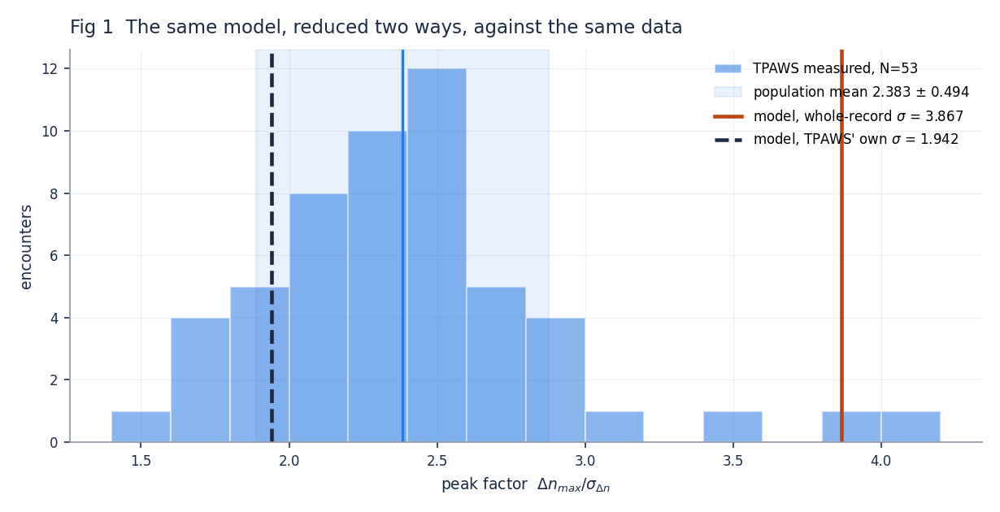
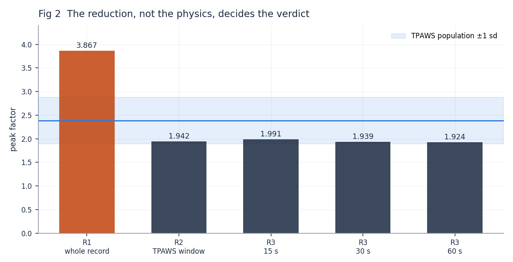
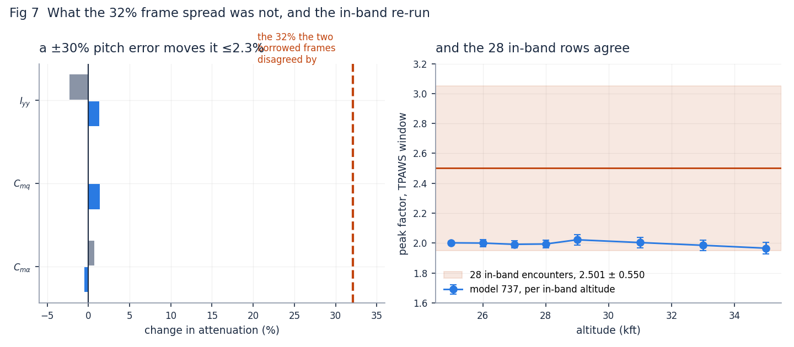
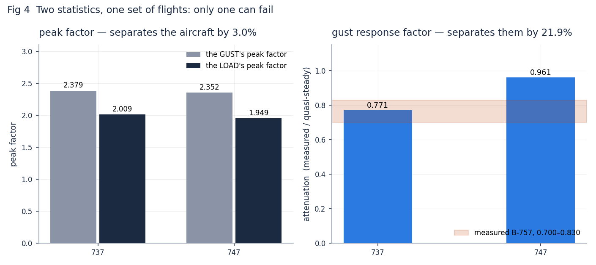
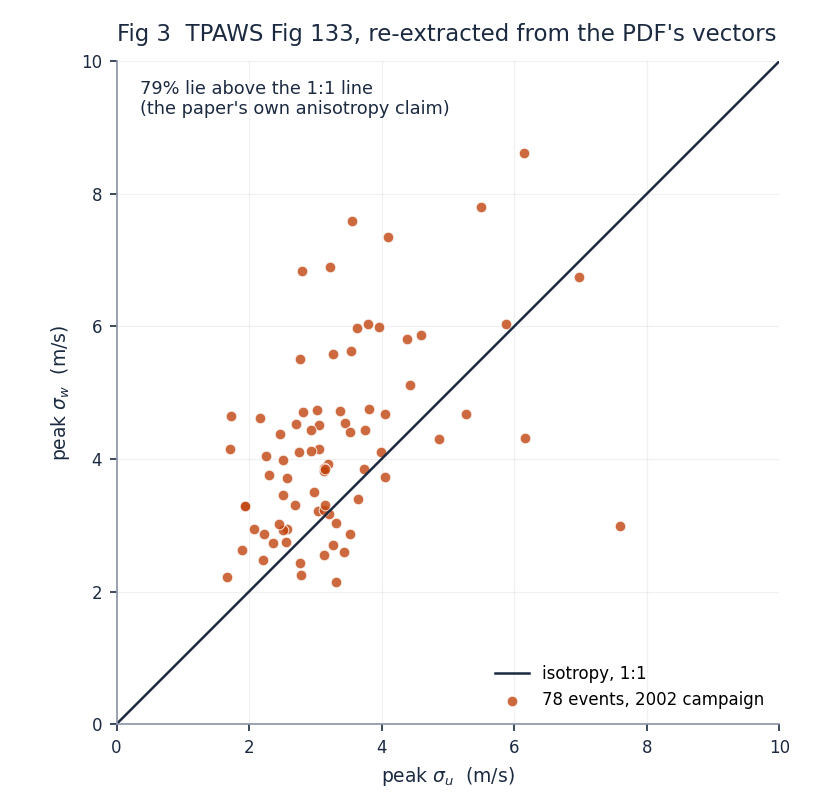
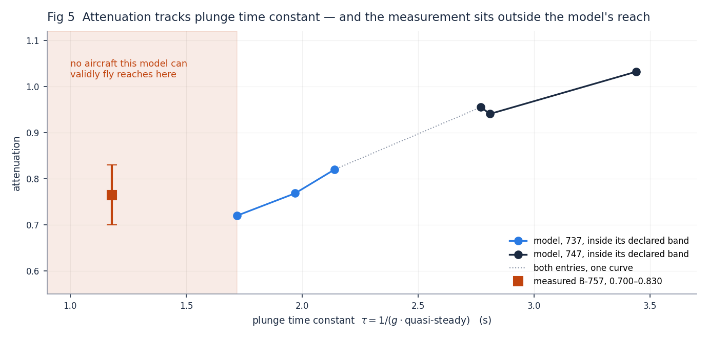
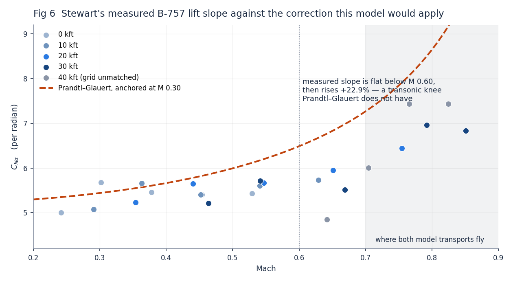

# Validating AtiSim's turbulence response against measured flight data

**Session 34 · September 2026 · branch `turbulence-response-validation-g6t99y`**

Figures regenerate with `scripts/turbulence_validation_figures.py`. Every number below is
reproducible from a committed script; the standing record is `docs/PROJECT.md` §0, §3, §4,
§7, §9 and §10, and this document is the narrative version of it, not a substitute.

---

## 1. What this set out to do

AtiSim is a 6-DOF flight dynamics model written to study how an aircraft responds to
clear-air turbulence. The aim is a **predictive tool** — something whose load predictions can
be relied on rather than merely inspected.

A previous session verified the gust path against exact mathematics (phases V1–V5) and
designed an acquisition half (S0–S2) that would compare the model against measured flight
data. That half was blocked: three published documents were needed and none was reachable.

This session unblocked it, ran it, and then spent most of its effort on a question the
programme had not asked: **which of these comparisons could ever have told us the model was
wrong?** That question turned out to matter more than any individual result.

### The sources

| document | what it supplies | status |
|---|---|---|
| **NASA/TM-2012-217337** (TPAWS) | Table 1: 53 measured turbulence encounters on NASA Langley's **B-757 ARIES** — altitude, weight, TAS, load rms, load extremes, peak vertical wind | fetched, ingested |
| **NASA/TM-2003-212666** (Stewart) | Table 1: the same B-757's normal-force coefficients against Mach and altitude | fetched, ingested |
| **MIL-F-8785C** | the Dryden turbulence spectra | already on disk since session 25 |

The first two were reported unreachable because the previous session ran in a container whose
network refused `ntrs.nasa.gov`. From an ordinary machine they download in seconds. The third
had been on the hard drive for weeks — invisible because reference PDFs are deliberately kept
out of version control, so a fresh working copy cannot see them.

**That is the first lesson of the session, and it is about record-keeping rather than
turbulence:** a gap that is a gitignore artefact looks exactly like a gap that is real.

---

## 2. The data, and a correction

TPAWS Table 1 extracts from the PDF's text layer, so there is no reading uncertainty. It has
**53 rows.** The design document that specified this work says 51, and every statistic it
derived came from 51.

The two missing rows are `232-05`, whose altitude prints **"31 to 35"**, and `235-05*`, which
prints **"22 to 19"** — a descent, written high-to-low. A parser expecting a single number
dropped exactly those two.

**Why this is worth more than the correction it produces.** Both dropped rows sit strictly
*inside* the extremes on every other column, so every printed range in the design document is
correct. Only the count was wrong. **A range check cannot catch a dropout that is interior on
every axis** — which is a general lesson about validating extractions, not a fact about this
table. The test now pins the two ranged rows themselves rather than the ranges.

Re-derived on the true population, the headline statistic moves from 2.386 to **2.3831** —
0.13%, and it settles nothing by itself.

---

## 3. Result 1 — the same model, reduced two ways, gives opposite verdicts

A prediction had been sealed before any deciding measurement: that the model's **peak
factor** — the ratio of a load extreme to the load's own rms — would land *below* what TPAWS
measured. Whoever sealed it attached a condition: before comparing, someone must read NASA's
report and establish exactly how NASA defined its σ.

That condition turned out to be the entire question.

**Fig 1** shows the 53 measured encounters as a histogram, with the model's answer drawn
twice. Reduced the way the previous session reduced it — σ over a whole 20-minute record —
the model reads **3.8674** (red), far outside the measured population. Reduced the way TPAWS
itself defines σ — the maximum over the encounter of a **5-second running standard
deviation** — the same flights read **1.9421** (dashed), comfortably inside.

The definition is established from three places in the document: printed p. 5 defines σ over
a sliding 5 s window subtracting that window's own mean; p. 125 calls the tabulated scalar
"the peak σ"; p. 8's column header governs the extremes alongside it.

**Fig 2** shows this is not a knife-edge. The whole-record reduction sits at 3.867; TPAWS'
window gives 1.942; and chopping the record into encounter-length segments to match the
document's own "several seconds to a minute" gives 1.991, 1.939 and 1.924 at 15, 30 and 60
seconds. **Every reduction that matches the data's own definition lands inside the band, and
the one that does not lands far outside.**

The whole-record column reproduces the previous session's published 3.8674 and 4.0199 to four
decimal places, which is what licenses this as a *re-reduction of the same flights* rather
than a different experiment.

**What it means.** The apparent disagreement was an accounting difference, not a physical
one. The two sides were never measuring the same quantity. The prediction was right — but
for a reason its own stated mechanism got wrong: it bet that the turbulence field's
construction would drive the result, and under this reduction that contributes
+0.0092 ± 0.0375 (0.25 σ), with the sign reversed.

---

## 4. Result 2 — flying the aircraft whose envelope matches the data

The comparison above used the model's 747, whose declared validity band is 35,000–45,000 ft.
That admits **3 of the 53 encounters**. The model's 737 declares 25,000–35,000 ft at
M 0.68–0.88 — which is where the data actually sits. That admits **28**, every one inside
both the altitude and the Mach band.

**Fig 7, right panel** shows the re-run: eight conditions, one per distinct in-band altitude,
64 flights. The in-band encounters are *peakier* than the full set — 2.5013 ± 0.5503 against
2.3831 ± 0.4942 — so the target moves when the band is applied. The model lands at
**1.9960 ± 0.0101**, inside.

Two checks ran beside it. **Intensity invariance passes** at 0.84% across a fourfold range of
turbulence strength, confirming the peak factor behaves as a normalised ratio rather than
tracking intensity. **The validity-band check fires at both edges** — 0.023 and 0.046
band-widths of excursion at 25 and 35 kft, exactly zero at the six interior conditions.
Roughly 460 ft of drift on a 10,000 ft band over 20 minutes. Small, real, and reported rather
than tuned away.

**So the original conclusion survives being redone properly.** But the re-run also disproved
the recommendation that produced it, which is the more useful outcome.

---

## 5. Result 3 — why that comparison could never have failed

Switching aircraft entirely — different airframe, different derivative set, 37,000 ft at
M 0.80 against 25–35,000 ft at M 0.70–0.79 — moves the peak factor by **2.78%**. The measured
population's spread is **ten times that**.

**Fig 4, left panel** shows why, measured rather than argued. The gust field arrives with a
peak factor of ~2.36. Each aeroplane attenuates it to ~1.95–2.01 — **by the same factor,
0.84, for both.** The aeroplane barely alters the extreme-value structure of what hits it.

The reason is structural. **A peak factor is a load divided by its own rms, so it normalises
away exactly the quantity that distinguishes aeroplanes** — the gain from gust to load. It
cannot fail for an aerodynamic reason because the aerodynamics cancel.

**This reframes the whole S2 result.** It is largely a test of the turbulence generator and
of the reduction, not of the aircraft model. Getting 28 encounters instead of 3 fixed
*admissibility* and left *discrimination* untouched. More of the right data cannot rescue a
statistic that cannot fail.

---

## 6. Result 4 — the missing measurement, recovered as vectors

The statistic that *does* discriminate is the **gust response factor**, σ_nz/σ_w: load rms
per unit gust rms. Quasi-steadily it equals ρVS·C_Lα/(2mg) — lift slope over wing loading,
pure aerodynamics, with nothing that cancels. Dividing the measured ratio by that
quasi-steady value gives the **attenuation**: what unsteady lift, pitch response and the
aeroplane's own plunge remove.

Computing it from real data needed one term no table supplied — σ_w per encounter. It is in
TPAWS Figure 133.

**Fig 3** is that figure re-extracted. This is not a digitisation in the usual sense: the
chart is **born-digital vector art**, so each marker's coordinates are stated by the PDF and
both axes calibrate on the printed tick labels' own text boxes. The calibration residual is
**1.3 × 10⁻³ data units** — the author's plotting precision, not a reading error. Every other
figure in this project was read off a raster at 300–600 dpi with a pixel error budget.

The check that earns its keep is the paper's own claim: isotropy would put the points on the
1:1 line, and it states the data is biased toward higher σ_w. **79% of the 78 markers lie
above the line.** No range test could catch swapped axes — both quantities span a similar
band — so that statement is the only thing pinning the orientation.

**One caveat governs every use.** Figure 133 carries 78 points for *all* 2002 events; Table 1
carries the 49 *significant* 2002 events — and 49 is the paper's own count, which is what
confirms the subset was identified correctly. The scatter is unlabelled, so no marker pairs
to a row and every ratio must be **bracketed** rather than computed.

---

## 7. Result 5 — the measured B-757, and an aeroplane that could not be flown

Assembling TPAWS Table 1, Figure 133 and Stewart Table 1 gives the B-757's own gust response
attenuation: **0.700 – 0.830**, the bracket being the population mismatch. Its quasi-steady
factor is 0.08638 g per m/s, and its plunge time constant 1/(g·quasi) is **1.18 s**.

**Fig 4, right panel** puts the model beside it: 0.771 for the 737, 0.961 for the 747 —
**21.9% apart, against the peak factor's 3.0% on the same flights.** Eight times the
separation. This statistic discriminates.

The obvious next step was to fly a 757. It could not be done.

A 757 was built from its sourced quantities — mass, wing area, chord, lift slope — on top of
an existing entry's structure, because no held source gives a 757's pitch derivatives,
inertia, span or drag polar. Because *which* entry to borrow from is an arbitrary choice, it
was made **twice**. The two builds disagreed by **32%**, against a measured bracket only 17%
wide. **The modelled side is not determined.**

> The first attempt returned an attenuation of **3.019** — an aeroplane amplifying a gust
> threefold. It had replaced mass and kept the template's inertia, giving a 757's mass with a
> 747's pitch inertia. The two-frame check is the only reason that surfaced; a single build
> would have produced a confident, wrong number with no warning attached.

### What was actually missing

A search for a sourced 757 pitch set came up empty: NTRS across eight queries, a full-text
scan of every local PDF, and JSBSim's 61 shipped models. The one promising lead — Stewart's
own reference 5, NASA TP-3610 — turns out to be about a **Lockheed Electra**. A transport's
stability derivatives are the manufacturer's proprietary data; NASA's ARIES documents
describe what was bolted onto the aeroplane, not what the aeroplane is.

**But it was the wrong target.** Fig 7, left panel shows a ±30% error in C_mα, C_mq or I_yy
moving the attenuation by **at most 2.3%** — against the 32% the frames disagreed by. The 32%
was the rest of the assembly: lift intercept, moment intercept, drag polar, engine, and the
trim state those produce. Not the pitch set.

**Fig 5** shows the test has a form that needs no 757 at all. Attenuation is monotone in the
plunge time constant across *both* sourced aircraft, and the two interleave on one curve —
the 737 at τ = 2.14 s sits below the 747 at 2.77 s. So attenuation is a function of τ to this
resolution, and the B-757's τ is computed entirely from sourced quantities.

**And it still cannot be run, for a reason worth more than the test.** The measured B-757
sits at τ = 1.18 s. The lowest reachable inside any declared validity band is **1.72 s**. The
measurement lies **0.54 s outside the model's range**, in the shaded region, and reading the
curve there would be extrapolation.

**The gap is the result.** The B-757 is more gust-responsive than any aircraft this model can
validly fly — 31% lower in plunge time constant. Since the wing loadings nearly match
(4406 against 4375 N/m²), the difference is almost entirely **lift slope**.

---

## 8. Result 6 — the compressibility axis, checked from outside for the first time

That lift-slope difference pointed at something checkable. Stewart's Table 1 is a published
lift slope against Mach for a real transport, M 0.242–0.851 — and every Prandtl–Glauert claim
in this project had previously been checked only against the model's own algebra.

**The design problem is the trim confound.** Raising dynamic pressure at fixed altitude
raises Mach *and* lowers trim angle of attack, so a column of the table mixes them. But trim
lift is C_L = W/(q̄S): **at fixed q̄ the trim C_L is fixed too**, and Stewart tabulated at
roughly matched dynamic pressures across his altitudes. Reading *down* a matched-q̄ column
varies Mach at near-constant trim.

**Fig 6** shows the measured points by altitude against the correction the model would apply
if switched on.

| Mach band | n | mean C_Nα |
|---|---|---|
| 0.20–0.45 | 7 | 5.395 |
| 0.45–0.60 | 7 | 5.489 |
| 0.60–0.72 | 3 | 5.731 |
| 0.72–0.90 | 3 | **6.745** |

**The measured slope is flat to +1.8% below M 0.60 and then rises +22.9%.** That is a
transonic curve. Prandtl–Glauert has no such knee — it rises smoothly from M = 0 and keeps
rising toward M = 1. Column by column it over-predicts by **5.0% to 22.1%** on the resulting
coefficient.

**The two halves point opposite ways, which is why this matters.** The model currently
applies *no* compressibility correction at all — the machinery exists but no aircraft
declares a reference Mach, so the factor is exactly 1.

- **Below M 0.60 that is right.** Flat is what the data shows.
- **Above M 0.70 it is wrong — and that is where both transports fly.** The data puts the
  slope **+23.9%** above its low-Mach value there. The model flies a low-Mach lift slope at
  cruise Mach.

**The implication, flagged as an implication.** Lift slope's elasticity on the headline load
is +0.692, so a +23.9% error implies roughly **+16.6% on the load** — the same direction as
the project's recorded **32% load shortfall**, and about half of it. Three reasons that is not
a correction: the elasticity was measured over ±1–5% and this extrapolates it fivefold; it is
for a different load quantity; and normal force is not lift, on an aircraft that is not one of
the model's. **The shape transfers; the level does not.**

---

## 9. What this can be used for

**1. A validity envelope, stated honestly.** The model reproduces the *extreme-value
structure* of measured turbulence loads — how a peak relates to its own rms — under the
data's own reduction, on 28 in-band encounters. That is a real, defensible claim and it is
narrow. It does not extend to load *level*.

**2. A first external bound on the gust response gain.** The measured B-757 attenuation of
0.700–0.830 is a number this project had no equivalent of. Any future aircraft entry can be
checked against the attenuation-versus-τ curve, which is now established across two
independent entries.

**3. A concrete, prioritised improvement path.** The compressibility axis is the most
valuable open item — not because the machinery is missing, but because the existing machinery
is **the wrong shape**, and there is now outside data saying so. Switching Prandtl–Glauert on
would trade a known error at cruise for a new one below M 0.60.

**4. A reusable method for reading published figures.** The vector-extraction route gives
essentially exact coordinates from born-digital charts, at a fraction of the cost and error
of raster digitisation. Several figures in this project's back-catalogue could be re-read
this way.

**5. Specification of what to acquire.** Not a 757 pitch set — that was shown not to matter.
What is needed is either a validly-flyable entry near τ ≈ 1.2 s, or MIL-HDBK-1797 for the
rotational gust spectra that remain blocked.

---

## 10. What we learned

**Most of this programme's checks could only ever have found coding errors.** Of eight
comparisons, four compare the model against its own equations, two against engineering
formulae, one against a single measured scalar, one was ruled out. The self-consistency
checks found two genuine bugs and are worth having — but a transfer-function check passing by
116× says the code solves its own equations, not that those equations describe an aeroplane.

**A comparison can invert on a definition.** The peak factor moved from 3.87 to 1.94 — a
factor of two, and the difference between "badly wrong" and "right" — purely by adopting the
data's own averaging window. Any comparison against published data must pin the reduction on
**both** sides, from the source, before it runs.

**Normalised statistics divide out the physics you are trying to test.** This is the sharpest
lesson. The peak factor was chosen because it is regime-robust, and it is robust precisely
because it cancels the gain from gust to load. Robustness and discriminating power traded
directly against each other.

**Measured quantities can be circular.** Stewart's "measured" vertical gust is the measured
acceleration divided by the aircraft's own lift-curve slope. Driving the model with it and
comparing the load back would have produced an impressive time-history agreement that tested
two constants against each other. Every external comparison needs to state how its target
quantity was derived.

**Cross-checks catch what single runs cannot.** The two-frame build caught a physically
impossible result. The shared dynamic-pressure grid caught a page number parsed as data. The
anisotropy claim caught what a range check could not. In each case the check that worked was
the one testing a *relationship*, not a bound.

**A negative result can be the most actionable output.** The single most useful finding is
that the model cannot validly fly at the measured aircraft's operating point. That is not a
failure to produce a result — it is a precise statement of what the model's validated
envelope excludes, which is exactly what a predictive tool needs to carry.

---

## 11. What remains

| item | status |
|---|---|
| **Phase V5(a)** — rotational gust spectra against the specification | **blocked** on MIL-HDBK-1797 / MIL-STD-1797A. MIL-F-8785C has no rotational spectra at all: it derives its angular components from the translational ones |
| **The `pg_mach_ref` decision** | now has evidence under it, and the evidence says switching the existing machinery on is *not* the fix |
| **An entry near τ ≈ 1.2 s** | would make the gust response comparison runnable without extrapolation |
| **Three decisions** left open by the previous session | still open; one is sharpened — a larger ensemble should be reduced *both* ways, because the two disagree about the sign |

**Verification status.** Full suite 968 passed, 1 skipped, 1 xfailed, none failed.
Documentation builds clean under `-W`. A test that failed in the previous session's container
passes here, confirming its diagnosis that the failure was environmental and vindicating its
refusal to re-pin the value.
