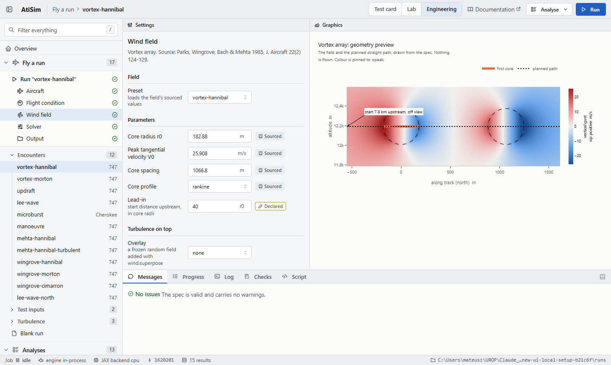
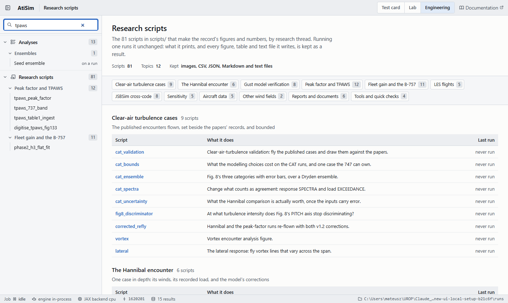
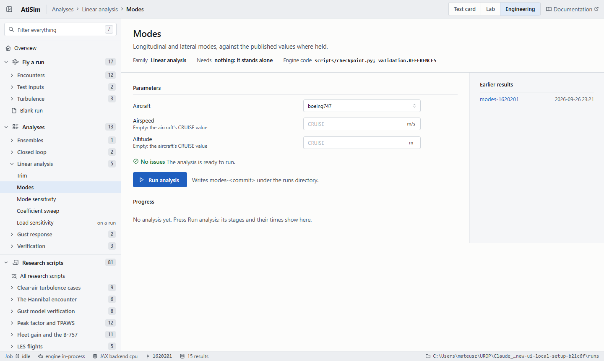
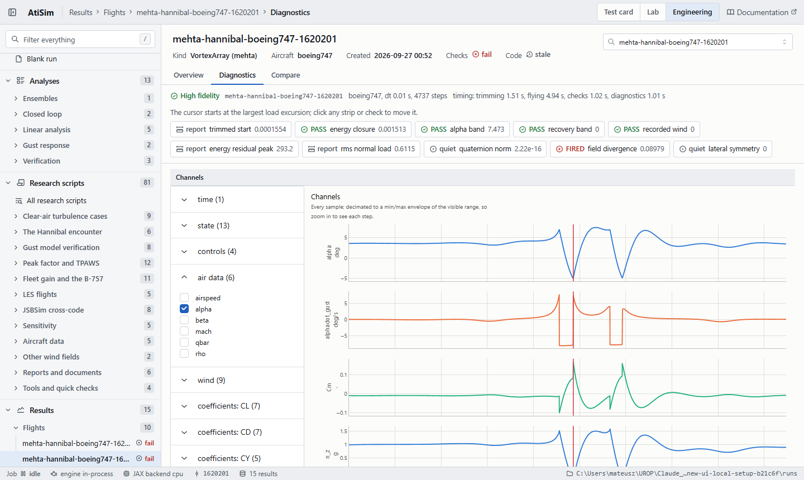
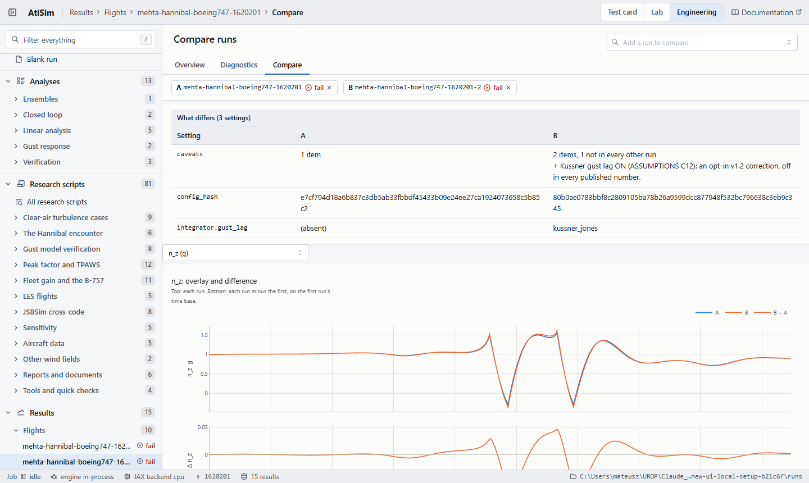
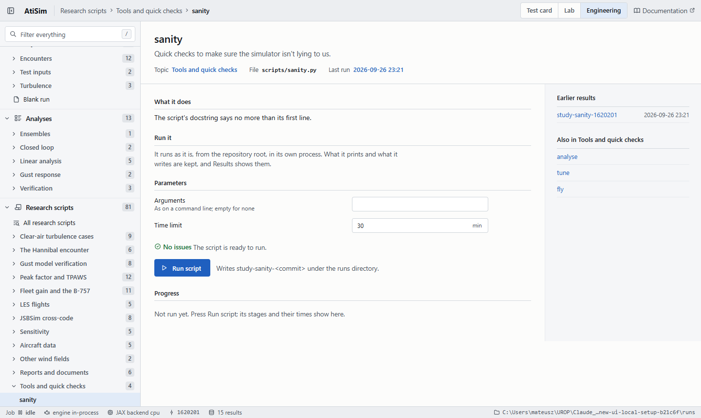
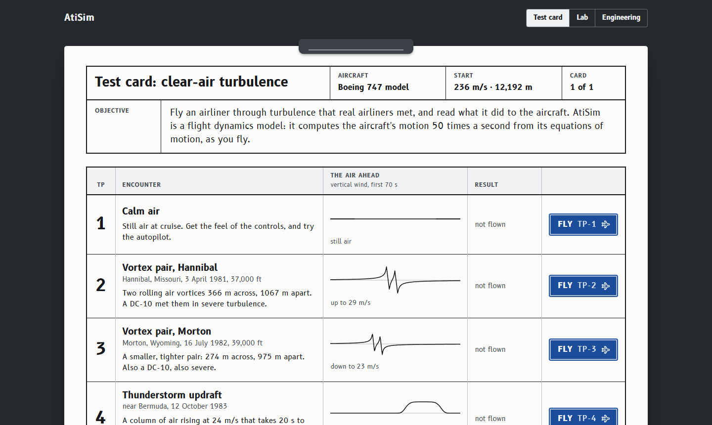
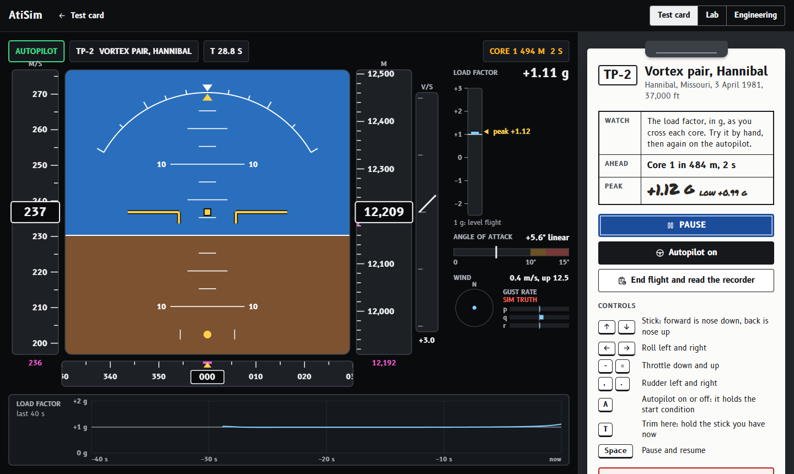
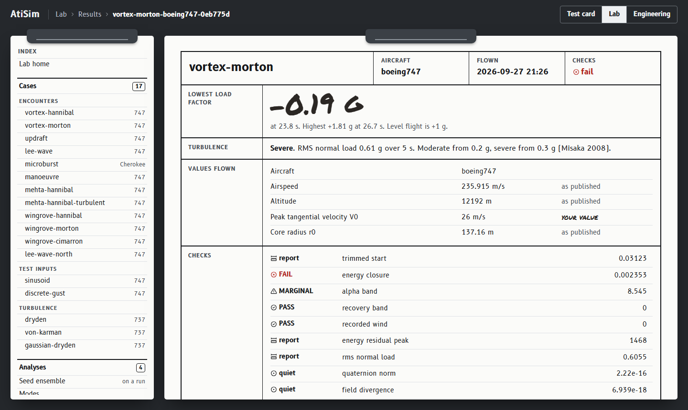

# User Manual

This manual tells you how to install AtiSim, how to run it, and how to use its results. For the
equations and the assumptions of the model, refer to {doc}`physics-and-assumptions`. To change
the code, refer to {doc}`development-manual`.

## 1 Introduction

### 1.1 What AtiSim does

AtiSim is a flight dynamics model with six degrees of freedom. It calculates the response of a
fixed-wing aircraft to turbulence. It has these parts:

- A rigid-body model of the aircraft, with quaternion attitude and a fixed-step RK4 integrator.
- Aircraft data for a Boeing 747, a Boeing 737 and two light aircraft.
- Wind fields: vortex arrays, updrafts, microbursts, mountain lee waves and Dryden turbulence.
- A trim solution, linear modes and sensitivities.
- A cockpit display, an autopilot, and an application with three modes: the test card, the
  Lab and engineering mode.

AtiSim uses JAX. You can compile a run with `jit`, and you can fly many runs at the same time
with `vmap`.

### 1.2 Limits of use

Use AtiSim to compare turbulence encounters and to find the mechanism of a response. Use it
only for the longitudinal response of a 747-class aircraft at Mach 0.70 to 0.90, between
35,000 ft and 45,000 ft. {doc}`physics-and-assumptions`, section 1, gives the full limits.

In random turbulence, the peak loads of the model are approximately 20% too small relative to
their rms. {doc}`physics-and-assumptions`, section 10.4, gives the measurement.

:::{caution}
Do not use AtiSim to calculate a design load or a certification load. AtiSim does not predict
absolute loads. An incorrect load can cause an unsafe design.
:::

### 1.3 How to use this manual

- Section 2 tells you how to install AtiSim.
- Section 3 gives the concepts that you must know before you use AtiSim.
- Section 4 gives the procedures for the usual tasks.
- Section 5 gives reference data: commands, scripts, keys, wind fields and analyses.
- Section 6 tells you what to do when a problem occurs.
- Section 7 is a glossary.

The procedures show commands for Linux and macOS. On Windows, use `.venv\Scripts\python.exe`
where the procedure shows `python` in an active environment.

## 2 Installation

### 2.1 Requirements

- Python 3.10 or later.
- The Python packages `jax`, `numpy`, `scipy` and `matplotlib`. The installation adds them.

### 2.2 Install AtiSim

1. Get a copy of the source code:

   ```bash
   git clone https://github.com/MatusGib/AtiSim.git
   cd AtiSim
   ```

2. Make a virtual environment:

   ```bash
   python -m venv .venv
   ```

3. Start the virtual environment:

   ```bash
   source .venv/bin/activate
   ```

4. Install AtiSim:

   ```bash
   python -m pip install -e .
   ```

### 2.3 Optional parts

Each optional part adds packages for a special task. To install a part, give its name in
brackets, for example `python -m pip install -e ".[ui]"`.

| Part | Packages | Use |
|---|---|---|
| `dev` | pytest, Jupyter, nbval | the tests and the notebooks |
| `ui` | Dash, Plotly, PyArrow, Dash Mantine Components, Dash Iconify | run files, the `atisim run` command and the application |
| `docs` | Sphinx, MyST, Furo | the documentation |
| `ref` | JSBSim | the scripts that make the JSBSim reference data |

### 2.4 Test the installation

1. Run the sanity checks:

   ```bash
   python scripts/sanity.py
   ```

2. Make sure that the last line is `11/11 checks passed`.

The sanity checks compare the model with values that you can calculate by hand. For example, an
aircraft with no aerodynamic forces must fall with the local gravity.

## 3 Concepts

### 3.1 Units and frames

| Item | Convention |
|---|---|
| Units | SI units: meters, seconds, kilograms and radians. `atisim.units` holds the conversion factors. |
| Inertial frame | NED: x north, y east, z down. The altitude is `-pos_ned[2]`. |
| Body frame | x forward, y right, z down. |
| Attitude | a quaternion `[w, x, y, z]` from the body frame to NED. |
| Wind | `wind_ned` is in NED. An updraft has a negative z component. `omega_gust` is in the body frame. |
| Precision | 64-bit floating point. The import of `atisim` sets this. |

:::{important}
Import `atisim` before you make a JAX array. The 64-bit setting has no effect on arrays that
exist before the import.
:::

### 3.2 Aircraft

The dictionary `atisim.aircraft.REGISTRY` holds the aircraft. The dictionary
`atisim.aircraft.CRUISE` holds a reference condition for each aircraft.

| Key | Aircraft | Reference condition | Use |
|---|---|---|---|
| `boeing747` | Boeing 747, from NASA CR-2144 | 12,192 m, 235.9 m/s | validated. Use this aircraft for turbulence studies. |
| `boeing747_approach` | Boeing 747, power approach | sea level, 84.9 m/s | modes and approach cases |
| `boeing747_jsbsim` | Boeing 747, from the JSBSim B747 | 11,582 m, 236.1 m/s | validated. Use it for comparison with JSBSim. |
| `boeing737` | Boeing 737, from JSBSim | 9,144 m, 236.5 m/s | comparison with JSBSim only |
| `boeing737_approach` | Boeing 737, approach | 1,524 m, 133.8 m/s | comparison with JSBSim only |
| `cherokee` | Piper Cherokee PA-28-180 | 1,500 m, 50 m/s | manual flight only |
| `cessna172` | Cessna 172 | 1,524 m, 60 m/s | manual flight only |

Each aircraft is a named tuple of JAX arrays: mass, inertia, geometry and stability
derivatives. Each derivative has a reference to the table that it comes from. The ledger
`atisim.provenance.LEDGER` gives the category of each constant: sourced, derived, calibrated or
declared.

### 3.3 Wind fields and wind models

A wind field is a function. It takes a position in NED, and it gives the wind in NED at that
position.

A wind model is the function that the integrator calls at each step. It gives the wind and
the gust rates. `wind.field_model(field)` makes a wind model from a wind field. It calculates
the gust rates from the gradient of the field.

### 3.4 A simulation run

A run has three steps:

1. The trim finds the angle of attack, the elevator and the throttle for steady level flight.
2. The rollout integrates the equations of motion with fixed controls, or with the autopilot.
3. The analysis measures the response: load factor, pitch angle, angle of attack and rates.

JAX compiles the rollout at the first run. Thus the first run is slow, and the subsequent runs
are fast.

### 3.5 Encounters

An encounter is one flight through a wind field. The module `atisim.vortex_viz` flies
encounters and measures them. It gives an `Encounter`, which holds NumPy arrays of the response.
The analysis window is the part of the flight that the measurements use.

| Field of `Encounter` | Content |
|---|---|
| `t` | time, s |
| `north`, `altitude` | position, m |
| `w_up` | vertical gust at the aircraft, m/s, positive up |
| `alpha_air` | angle of attack relative to the air, rad |
| `theta`, `q` | pitch angle, rad, and pitch rate, rad/s |
| `n_z` | normal load factor, g |
| `elevator` | elevator deflection, rad |
| `window` | a mask that is true inside the analysis window |

## 4 Procedures

### 4.1 Fly an encounter from the command line

1. Fly the 747 through the Hannibal vortex array, and save the figure:

   ```bash
   python scripts/vortex.py --case hannibal --png runs/hannibal.png
   ```

2. Open `runs/hannibal.png`.

The script flies a vortex, an updraft and an elevator maneuver. It prints a table of the results,
and it draws the analysis figure.

### 4.2 Fly the aircraft manually

1. Start the cockpit display with the Hannibal wind field:

   ```bash
   python scripts/fly.py --wind hannibal
   ```

2. Use the keys in section 5.2 to fly the aircraft.
3. To engage the autopilot, push `a`.
4. To keep the flight for later analysis, start the script with `--save runs/flight.npz`.

To fly the aircraft in a web browser, use the test card of the application (section 4.17).

### 4.3 Trim an aircraft and run a simulation

This example trims the 747 and flies it through the Hannibal vortex array for 60 s:

```python
import jax
import jax.numpy as jnp

import atisim  # sets 64-bit precision. Import it before you make an array.
from atisim import integrate, trim, wind
from atisim.aircraft import CRUISE, REGISTRY

ac = REGISTRY["boeing747"]
V, H = CRUISE["boeing747"]["airspeed"], CRUISE["boeing747"]["altitude"]

# Trim for steady level flight. x holds [alpha, elevator, throttle].
x, residual = trim.trim(jnp.array(V), jnp.array(H), ac)
state = trim.trimmed_state(x[0], jnp.array(V), jnp.array(H))
controls = trim.trimmed_controls(x[1], x[2])

# Start 5 km before the first vortex.
array = wind.mehta_hannibal_array(H)
state = state._replace(pos_ned=jnp.array([float(array.north.min()) - 5000.0, 0.0, -H]))
wind_model = wind.field_model(lambda p: wind.vortex_wind(p, array))

sim = integrate.init_sim(state, jax.random.PRNGKey(0))
final, history = integrate.rollout(sim, controls, jnp.array(0.01), ac,
                                   n_steps=6000, wind_model=wind_model)
```

`rollout` gives the last `SimState` and the `State` at each step. To fly with the autopilot, use
`autopilot.closed_loop_rollout`.

### 4.4 Fly an encounter and measure the load

1. Fly the 747 through the Hannibal field on its identified path:

   ```python
   import atisim
   from atisim import vortex_viz

   enc, info = vortex_viz.fly_mehta("boeing747", dt=0.01, replayed=True)
   ```

2. Read the load factor in the analysis window:

   ```python
   n_z = enc.n_z[enc.window]
   print(f"peak-to-peak load: {n_z.max() - n_z.min():.2f} g")
   ```

3. Make sure that the result is 1.89 g. AtiSim 1.1 gave 1.90 g, because it kept the wind
   constant during each time step (assumption E4). To get that value again, set
   `stage_sampled=False`.

The argument `replayed=True` samples the field along the path of the recorded aircraft.
{doc}`physics-and-assumptions`, section 10.3, gives the reason.

### 4.5 Fly with the gust lag and the wing–tail delay

Version 1.2 adds two optional corrections to the gust response. Both are off by default.

- The gust lag, `gust_lag=True`, delays the lift from a vertical gust as the Küssner function
  gives (assumption C12).
- The wing–tail delay, `tail_arm=l`, calculates the pitching gust from the gust at the center of
  gravity and the gust at the tail (assumption E13).

1. Get the tail arm. For `boeing747`, use the arm that the model derives from its derivatives. For
   `boeing737`, use `airframe.JSBSIM_HTAILARM_FT`:

   ```python
   import atisim
   from atisim import airframe, vortex_viz
   from atisim.aircraft import REGISTRY

   ac = REGISTRY["boeing747"]
   arm = float(airframe.effective_tail_arm(ac) * ac.c)
   ```

2. Fly the Hannibal encounter with both corrections:

   ```python
   enc, info = vortex_viz.fly_mehta("boeing747", dt=0.01, replayed=True,
                                    gust_lag=True, tail_arm=arm)
   n_z = enc.n_z[enc.window]
   print(f"peak-to-peak load: {n_z.max() - n_z.min():.2f} g")
   ```

3. Make sure that the result is 1.77 g.

The gust lag needs a time step less than `wind.kussner_max_dt`: 0.026 s for the 747 and 0.012 s
for the 737. A longer time step causes an error. To use the wing–tail delay with other fields, give
`wind_model=wind.sampled_field_model(field, airframe.stations(ac, n_lon=2, tail_arm=arm))`.

{doc}`physics-and-assumptions`, sections 9 and 10, gives the limits of the two corrections. They
are approximations. Do not think that they make every result more accurate.

### 4.6 Combine wind fields

Use `wind.superpose` to add two or more fields. Use `vortex_viz.fly` to fly any field:

```python
import atisim
from atisim import vortex_viz, wind
from atisim.aircraft import CRUISE, REGISTRY

ac = REGISTRY["boeing747"]
V, H = CRUISE["boeing747"]["airspeed"], CRUISE["boeing747"]["altitude"]

array = wind.mehta_hannibal_array(H)
column = wind.UpdraftColumn(north=8000.0, east=0.0, w0=10.0, radius=2000.0, sharpness=4.0)
field = wind.superpose(
    lambda p: wind.vortex_wind(p, array),
    lambda p: wind.updraft_wind(p, column),
)

enc = vortex_viz.fly(ac, field, V, H, label="vortices and updraft",
                     start_north=-8000.0, seconds=90.0,
                     window=(-3000.0, 12000.0), window_name="the disturbed part")
```

### 4.7 Add a wind field

1. Write a function that takes a position in NED and gives the wind in NED, in m/s.
2. Use only `jax.numpy` in the function, so that JAX can calculate its gradient.
3. Give the function to `vortex_viz.fly`, or to `wind.field_model` for a rollout.

The upward wind is negative in NED. For example, this field is a uniform updraft of 2 m/s:

```python
import jax.numpy as jnp

def uniform_updraft(pos_ned):
    return jnp.array([0.0, 0.0, -2.0])
```

The full wind-model interface is in {doc}`physics-and-assumptions`, section 7.1.

### 4.8 Calculate the linear modes

This example gives the phugoid and the short-period modes of the 747 at cruise:

```python
import jax.numpy as jnp

import atisim
from atisim import trim, validation
from atisim.aircraft import CRUISE, REGISTRY

ac = REGISTRY["boeing747"]
V, H = CRUISE["boeing747"]["airspeed"], CRUISE["boeing747"]["altitude"]
x, _ = trim.trim(jnp.array(V), jnp.array(H), ac)
alpha, elevator, throttle = (float(v) for v in x)

(ph_wn, ph_zeta), (sp_wn, sp_zeta) = validation.longitudinal_modes(
    ac, alpha, elevator, throttle, V, H)
```

Each mode is a pair of the natural frequency, in rad/s, and the damping ratio.
`validation.lateral_modes` gives the lateral modes. `atisim.sensitivity` gives the change of a
result when a coefficient changes.

### 4.9 Fly an ensemble

1. Make one Dryden field for each seed with `wind.dryden_field(sigma, seed)`.
2. Fly each field.
3. Use `atisim.response` to calculate the spectrum and the exceedance rate of the response.

The scripts `cat_ensemble.py` and `cat_spectra.py` are complete examples. For a batch of runs
with one deterministic field, use `integrate.batch_sim` and `integrate.batched_rollout`.

### 4.10 Set up a run, fly it and examine it

The application and the `atisim run` command need the `ui` part (section 2.3). The
application operates on your computer only, at `http://127.0.0.1:8050/`.

The application has three modes. The mode switch at the top of each page selects the mode:

- **Test card**: four test points that you fly in a cockpit in the web browser. Section 4.17
  gives the procedure.
- **Lab**: the preset cases with a few values that you can change, four analyses, and a
  comparison of two results. Section 4.18 gives the procedure.
- **Engineering**: all the values of a run, all the analyses, the research scripts and all the
  results. This section and sections 4.11 to 4.15 give the procedures.



#### 4.10.1 Use the application

1. Start the application:

   ```bash
   atisim ui runs
   ```

   The application opens in your web browser, on the test card. `runs` is the directory for
   the run files. The first run makes this directory. To use a different port, add
   `--port 8060`. To start without a browser tab, add `--no-browser`.

2. Click **Engineering** in the mode switch. The Overview page opens.
3. In the explorer on the left, under **Fly a run**, click a preset. The Setup page opens with
   the values of the preset.
4. In the model tree at the top of **Fly a run**, click an item: Run, Aircraft, Flight
   condition, Wind field, Solver or Output. The Settings panel shows the values of that item.
5. Change the values that you must change. Section 4.10.2 tells you about the markers.
6. Examine the Graphics panel. It shows the wind field and the planned flight path. The
   application does not fly the aircraft to make this preview.
7. Examine the Messages tab. Correct each error. Click a message to go to its item in the
   tree.

   An error disables the Run button. Put the mouse pointer on the Run button to see the first
   error.

8. Click **Run**. The Progress tab shows each stage and its time. The Log tab shows the output
   of the run.
9. When the run is complete, the Checks tab opens. Click **Open in Results**.

   The Results page opens with the time cursor at the worst sample of the first gate that
   failed. If no gate failed, the cursor is at the start of the run.

10. Click a point in a time series. All panels move to that time, and the wind field panel
    shows the position of the aircraft. Click a check to move the cursor to its worst sample.

    The wind field panel shows a 2-D cross-section or a 3-D scene. A run without a wind
    field, for example the maneuver, has no cross-section. The panel shows the 3-D scene.

    The top of the Results page shows the values of the run. Each Declared value has its
    marker. Put the mouse pointer on the marker to see the reason.

The first run is slow, because JAX compiles the run. The next runs use the compiled code.

If the run fails, for example because the trim fails, the Messages tab opens. The first message
shows the cause and the change to make. Click it to go to the value to change. The message
stays until you change the spec. The application continues to operate.

#### 4.10.2 Sourced and Declared values

Each value in the Settings panel has a marker:

- **Sourced**: the value comes from the publication that the preset cites. Put the mouse
  pointer on the marker to see the source.
- **Declared**: the value is a decision, not a published value. The marker shows the reason.

If you change a Sourced value, it becomes Declared. To put the published value back, click the
reset button next to the marker. A run with a changed value is not a sourced result. The run
file records each Declared value and its reason.

#### 4.10.3 Run files

Each run writes a new directory in the runs directory: `{name}-{aircraft}-{commit}`. If this
directory exists, the application adds `-2`, `-3` and so on. A run does not overwrite a
different run.

The Script tab shows the `atisim run` command, the JSON spec and the Python code that fly the
same run. Use them to fly the run again without the application.

To read a saved run in Python, use `atisim.analysis.artifact.read_run`.

#### 4.10.4 Fly a run with the atisim command

1. Show the presets:

   ```bash
   atisim presets
   ```

2. Fly a preset, and write the run file in `runs`:

   ```bash
   atisim run --preset vortex-hannibal --out runs
   ```

   To change a value, add `--set`, for example `--set wind.r0=150 --set lead_in=20`. A
   changed wind value becomes Declared. To fly a JSON spec from the Script tab, give its path
   in place of `--preset`.

3. Show the runs, with the newest run first:

   ```bash
   atisim list runs
   ```

   Each line shows the result of the checks: `pass`, `warning` or `fail`. `stale` shows a run
   that a different commit of the code made. `ERROR` shows a run file that the command cannot
   read.

`atisim run` stops with exit code 2 if the spec has an error, and with exit code 1 if the trim
fails.

The script `vortex.py --artifacts` also writes run files: the vortex, the updraft and the
maneuver. The command `python -m atisim.apps.sweep runs/analysis` opens the application on the
Results page.

#### 4.10.5 Select the wind field and the solver options

The Wind field item gives each wind field of the engine as a preset. Examples are a vortex
array, a single vortex core, the Mehta Hannibal field, an updraft, a lee wave and a microburst.
Other presets give a gust sinusoid, a 1 − cosine gust, and Dryden, von Kármán and Gaussian
turbulence. Section 5.3 gives the fields.

1. In the model tree, click **Wind field**.
2. Select a preset in **Preset**. The parameters of that field show below it.
3. To add turbulence to a deterministic field, select a turbulence model in **Overlay**. The
   run adds the two winds with `wind.superpose`.
4. In the model tree, click **Solver**. Set these options if necessary:
   - **Stage-sampled wind**: the run samples the wind at each RK4 stage. This is the default.
   - **Kussner gust lag**: the lift follows a vertical gust with the Küssner lag. The time
     step must be small. The Messages tab shows the limit.
   - **Wing-tail gust delay**: the tail gets the gust later than the wing.
   - **Fidelity**: Standard or High. Section 4.12 tells you about High fidelity.

The command `atisim run --set KEY=VALUE` sets the same options, for example
`--set gust_lag=true`.

#### 4.10.6 Find a page in engineering mode

The explorer on the left of engineering mode gives all its items:



- **Overview**: the number of each item, the first steps, and the recent results.
- **Fly a run**: the presets, in the groups Encounters, Test inputs and Turbulence.
- **Analyses**: the analyses, in their families.
- **Research scripts**: the scripts in `scripts/`, in their topics.
- **Results**: the runs and the reports, in the groups Flights, Analysis reports and Script
  outputs.

1. To find an item, type a part of its name or of its description in the filter at the top of
   the explorer. To go to the filter from a different location, push `/`.
2. To clear the filter, push `Esc`.
3. To hide the explorer, click the button at the left of the header. To show it again, click
   the button again.

The header shows the location of the page in the explorer. The explorer marks the item of the
page on the screen.

### 4.11 Run an analysis

An analysis is a simulation that is not one open-loop flight. Examples are a seed ensemble, the
autopilot step responses, the linear modes, a gust transfer sweep and a convergence study.
Section 5.4 gives all the analyses. An analysis writes a report: figures, tables and a summary.



**Use the application**

1. In the explorer, under **Analyses**, click an analysis. The page shows what the analysis
   does, its parameters and its earlier results.
2. Change the parameters that you must change. Examine the issues below the parameters.
3. If the analysis shows **on a run**, select the run in **Run**. **The run in Setup** is the
   spec on the Setup page.
4. Click **Run analysis**. The Progress table shows each stage and its time.
5. When the analysis is complete, click **Open in Results**. Results shows the report.

On the Setup page, the **Analyse** menu starts an analysis on the spec that you edit. On a
report, **Run again** opens the analysis with the same parameters.

**Use the atisim command**

1. Show the analyses:

   ```bash
   atisim analyses
   ```

2. Run an analysis, and write its report in `runs`:

   ```bash
   atisim analyse modes --set aircraft=boeing737 --out runs
   ```

   An analysis on a run needs `--base`, with a preset name or a spec file, for example
   `atisim analyse ensemble --base dryden --set members=16 --out runs`.

Each report is a directory `{name}-{commit}` in the runs directory. The members of an ensemble
are run directories in the report directory. Results opens each member as a run.

### 4.12 Examine a run in high fidelity

High fidelity records all the terms of the model at each sample of a run. It does not change
the flight. A High run and a Standard run of the same spec have the same `run.parquet`, the
same checks and the same `config_hash`.



1. Set **Fidelity** to **High** on the Solver item, and fly the run. Or use the command:

   ```bash
   atisim run --preset mehta-hannibal --fidelity high --out runs
   ```

2. In the explorer, under **Results**, click the run. Click **Diagnostics** below the name of
   the run.

   The cursor is at the largest excursion of the load factor. Click a strip or a check to move
   the cursor.

3. Use the parts of the Diagnostics view:
   - **Channels**: select the channels to show. The strips show each sample. Zoom in to see
     each step.
   - **Budgets**: the terms of a coefficient, the forces and moments by source, and the
     energy. A sentence names the term that changes the coefficient most at the cursor.
   - **Step inspector**: click **Inspect the step at the cursor**. The inspector flies the
     step again from the log, and again as ten steps of dt/10. It shows the four RK4 stages.
   - **Scene, high detail**: the aircraft at the cursor, with its body axes, its velocity and
     the wind. Click **Play** to move the cursor through the run at the selected speed. At
     1x, one second of flight takes one second. The scene changes one time each second.
   - **Check profiles**: each check as a time series, with its tolerance.

A Standard run shows the check profiles only. Click **Re-fly at High** to fly the same spec at
High fidelity.

High fidelity writes the file `diagnostics.parquet` in the run directory. To read it in Python,
use `atisim.analysis.diagnostics.read`.

### 4.13 Compare two runs



1. In the explorer, under **Results**, click the first run (A). Click **Compare** below the
   name of the run.
2. In **Add a run to compare**, select a second run (B). You can add more runs.
3. Examine **What differs**. It shows each value of the spec that is not the same in the runs.
   A list, for example the caveats, shows its number of items and the items that the other
   runs do not have.
4. Select a channel. The top plot shows each run. The bottom plot shows each run minus A.

If all the runs are High runs, the channels of `diagnostics.parquet` are also available.

To make run B from run A, use the controls below the plot:

- **Fly the change**: select a **Field** and type the **New value**. The text next to the
  value shows its form, for example "true or false". Then click **Fly the change**.
- **Refine A**: fly A with dt, dt/2 and dt/4, and show the convergence report.
- **Fly A at this commit**: fly A with a different version of the engine. Section 4.14 tells
  you about this control.

When the new run is complete, Compare adds it.

### 4.14 Change the engine and examine the effect

Use the engine-development mode when you change the code of the engine.

1. Start the application in engine-development mode:

   ```bash
   atisim ui runs --dev
   ```

   The runs and the analyses fly in a worker process. The status bar shows the commit of the
   worker and the time that it started. Without `--dev`, the status bar shows
   **engine in-process**.

2. Fly a run.
3. Change the engine, for example `atisim/aero.py`. The status bar shows
   **engine changed on disk**.
4. Click **Reload engine** in the status bar. The next run starts a new worker with the changed
   engine.

The worker keeps the compiled code in the directory `.jax-cache` in the runs directory. Thus
the first run after a reload is faster than the first run of the application.

To fly a run with the engine of a different commit:

1. Open Compare with the run as A (section 4.13).
2. Type a git reference in **Git ref**, below **Fly A again with one change**. For example,
   type `main` or a commit SHA.
3. Click **Fly A at this commit**.

The application makes a git worktree at that commit and flies the spec there. Then it removes
the worktree. The new run has the SHA of that commit in its name, and Compare adds it. A commit
before `atisim/cli.py` cannot fly a spec. The application tells you so and gives the first
commit that can.

### 4.15 Run a script as a study

A study runs one of the scripts in `scripts/` with no change. It keeps the output of the script
as a report. The report shows the log, the images, a part of each CSV table, and links to the
other files.

The explorer puts each script in a topic, for example **Clear-air turbulence cases** or
**LES flights**. A script that has no topic is under **Other scripts**.



1. In the explorer, under **Research scripts**, click a topic, and then click the script. To see
   all the scripts in one table, click **All research scripts**.
2. Read **What it does**. It gives the docstring of the script.
3. If the script needs arguments, type them in **Arguments**.
4. Click **Run script**. The Log shows each line of the output of the script.
5. When the study is complete, click **Open in Results**. The page of the script also shows the
   study under **Earlier results**.

Or use the command:

```bash
atisim studies
atisim study sanity --out runs
```

Put the arguments of the script after `--`, for example `atisim study NAME -- --quick`.

The script runs from the root of the repository. It writes its files in the usual location. The
study copies each PNG, SVG, CSV, JSON, Markdown and text file that the script wrote to the
directory `files` in the report. Some scripts need data that the repository does not include.
These scripts stop with their own error message, and the study shows that message.

### 4.16 Do the validation again

The validation needs the `dev` part (section 2.3).

1. Open the validation notebook:

   ```bash
   python -m jupyter lab notebooks/validation-ladder.ipynb
   ```

2. Run all cells.

The notebook does the validation in four steps: checks by hand, the source data, a recorded
encounter, and the published orders of loads. Each step makes assertions. The notebook
`notebooks/solver-validation.ipynb` does a check of the integrator.

### 4.17 Fly a test point in the cockpit

The test card is the first page of the application. It gives four test points: calm air, the
Hannibal vortex pair, the Morton vortex pair and a thunderstorm updraft. The cockpit flies the
747 in your web browser. It uses the same model and the same loop as `scripts/fly.py`.



1. Start the application (section 4.10.1). The test card opens.
2. Examine **The air ahead** of each test point. It shows the vertical wind on a straight,
   level path. The application calculates it from the wind field. It does not fly the aircraft
   for it.
3. Click **FLY** on a test point. The cockpit opens.

   The first flight after a start of the application can take some seconds, because JAX
   compiles the model.

4. Push `Space` to start the flight.
5. Fly the aircraft with the keys in section 5.2. The up arrow moves the stick forward, and the
   nose goes down.
6. To engage or disengage the autopilot, push `a`. The autopilot holds the start altitude,
   airspeed and heading.
7. To pause the flight, push `Space` or `Esc`.
8. Click **End flight and read the recorder**. The debrief shows the load factor that is
   furthest from +1 g, the turbulence severity, the bank, the height change, the angle of attack
   and the validity of the flight. The recorder shows the load factor, the height change and the
   bank at each step. In grey, it shows what the source measured (section 4.19).

   The application saves the flight as a run in the runs directory. Its name is
   `testcard-{test point}-{aircraft}-{commit}`.
9. Click **Back to the test card**. The card shows the peak load factor of your flight on the
   row of the test point.
10. To examine the flight in engineering mode, click **Engineering** in the mode switch. Results
    opens with your last flight. Or click **Open in engineering** on the row of a test point.



The cockpit shows the gust rate as SIM TRUTH, because no instrument can measure it. The peak on
the kneeboard comes from 25 samples each second. The debrief reads each step of 20 ms. Thus the
peak of the debrief can be a little larger.

In calm air, the debrief shows "None: still air" for the turbulence. The load then comes from
your control inputs.

A saved flight has no spec, because the controls are your inputs. Thus **Re-fly at High**,
**Fly the change** and **Fly again with changes** are not available for it. The cockpit steps
0.02 s, twice the step of the presets. Thus the energy closure check of a saved flight can fail.

### 4.18 Fly a case in the Lab

The Lab is between the test card and engineering mode. It flies a preset with a few changed
values, and it shows the result in plain words.



1. Click **Lab** in the mode switch.
2. In the index on the left, under **Cases**, click a case.
3. Change the values that you must change: the aircraft, the airspeed, the altitude, and one or
   two values of the wind field.

   A changed value shows **your value**. A value from the source shows **as published**. Put
   the mouse pointer on the mark to see the source or the reason.

4. Examine the **Limits** box. Correct each error. An error disables **Run the case**.
5. Click **Run the case**. The stages of the run show below the button. When the run is
   complete, the result card opens.
6. Examine the result card: the load factor that is furthest from +1 g, the turbulence severity,
   the values of the flight, the checks and the recorder. In grey, the recorder shows what the
   source measured (section 4.19).
7. To fly the case again with changes, click **Fly again with changes**.

If you select a different aircraft, the airspeed and the altitude change to the cruise values
of that aircraft.

The Lab gives four analyses: the seed ensemble, the modes, the step-size convergence and the
JSBSim cross-code check. To run one, click it under **Analyses** in the index. Its page tells
you what you learn from it.

To compare two results:

1. Under **Results** in the index, click **Compare two results**.
2. Select a result in **A** and a result in **B**.
3. Examine the table. It gives the aircraft, the flight condition, the values of the wind field
   and the results. The mark **differs** shows each value that is not the same.
4. Examine the recorder. It shows the load factor, the height change and the pitch of the two
   results.

The Lab keeps each run in the runs directory. Engineering mode shows the same run with all its
values.

### 4.19 Compare a run with the paper record

A run of a sourced case can show what the source measured in the same encounter. The application
shows this record in grey on the load factor:

| Case | Record |
|---|---|
| Hannibal: `vortex-hannibal`, `wingrove-hannibal`, `mehta-hannibal`, test point 2 | The load factor of the DC-10, recorded through the encounter (Parks et al. 1985, Fig. 6), and the measured band, +1.7 to −1.0 g (TM-102186) |
| Other vortex cases, the updraft and the manoeuvre | The band of the lowest load of the DC-10 records, −1.01 to −0.69 g (Wingrove and Bach 1994, Fig. 8) |

1. Open the run in Results. The **Paper record** switch shows the record on the load factor
   strip.
2. Read the line below the switch. It names the source and tells you what to compare.
3. To hide the record, click **Paper record**.

The recorded trace has the clock of the DC-10. The application moves it in time so that the
deepest downdraft of the record is at the deepest downdraft of the run. This alignment is a
declared choice. It aligns the wind, not the load, so the loads can differ.

The records are of a DC-10, and the model is a 747. Compare the order and the size of the loads.
Do not compare their exact values.

The debrief of the test card and the result card of the Lab show the same record.

## 5 Reference

### 5.1 Command-line scripts

**The atisim command**

Each command shows its options with `--help`. Section 4.10 gives the procedures.

| Command | Function |
|---|---|
| `atisim ui [RUNS]` | Start the application. Options: `--port`, `--no-browser`, `--dev` (section 4.14). |
| `atisim run --preset NAME` or `atisim run SPEC.json` | Fly one run, and write its run file. Options: `--out`, `--set KEY=VALUE`, `--fidelity high` (section 4.12). |
| `atisim presets` | Show the presets and their sources. |
| `atisim analyses` | Show the analyses (section 5.4). |
| `atisim analyse NAME` or `atisim analyse --spec SPEC.json` | Run one analysis, and write its report. Options: `--base`, `--out`, `--set KEY=VALUE`. |
| `atisim studies` | Show the scripts that run as studies. |
| `atisim study NAME [-- ARGUMENTS]` | Run one script as a study, and write its report. Options: `--out`, `--minutes`. |
| `atisim list [RUNS]` | Show the runs and the reports, with the newest first, and the result of their checks. |

**Scripts**

Run the scripts from the root of the repository. Each script shows its options with `--help`.
If you give `--png` or `--outdir`, the script writes its figures to that location. If not, the
script opens a window.

**Flight and encounters**

| Script | Function |
|---|---|
| `fly.py` | Fly the aircraft manually with a cockpit display. Options: `--aircraft`, `--wind`, `--autopilot`, `--save`. |
| `vortex.py` | Fly a vortex, an updraft and an elevator maneuver, and draw the analysis figure. Options: `--case`, `--strip`, `--artifacts`. |
| `microburst.py` | Fly through a microburst, and compare the F-factor with the thrust of the aircraft. |
| `leewave.py` | Fly the 747 through a mountain lee wave. |
| `lateral.py` | Fly vortex lines that change across the span, and show the roll response. |
| `analyse.py` | Analyze runs that `fly.py` saved. |
| `tune.py` | Show the step responses of the autopilot. |

**Validation**

| Script | Function |
|---|---|
| `sanity.py` | Do 11 checks against values that you can calculate by hand. |
| `checkpoint.py` | Trim the 747, and compare its modes with CR-2144. |
| `cat_validation.py` | Fly the published turbulence cases, and compare them with the papers. |
| `cat_ensemble.py` | Fly the three categories of TM-102186 Figure 8 through a Dryden ensemble. |
| `cat_spectra.py` | Calculate the response spectra and the exceedance rates of an ensemble. |
| `vortex_compare.py` | Compare AtiSim with JSBSim through the same vortex. |
| `cr2144_digitisation_crosscheck.py` | Compare the two readings of CR-2144 pages 220 to 222. |

**Reference data**

The tests use the stored data. Use these scripts only to make the data again.

| Script | Function | Necessary part |
|---|---|---|
| `gen_jsbsim_reference.py` | Make the 737 reference data from JSBSim. | `ref` |
| `gen_jsbsim_vortex_reference.py` | Make the vortex reference data from JSBSim. | `ref` |
| `gen_jsbsim_747.py` | Make the `boeing747_jsbsim` data from the JSBSim B747. | `ref` |
| `digitise_mil_f_8785c_fig7.py` | Read MIL-F-8785C Figure 7 from the PDF. | a copy of the document, with `--pdf` |

### 5.2 Keyboard controls

| Key | Function |
|---|---|
| Up arrow, down arrow | pitch. Up moves the stick forward, and the nose goes down. |
| Left arrow, right arrow | roll |
| `,` and `.` | rudder |
| `-` and `=` | throttle |
| `[` and `]` | pitch trim, nose down and nose up |
| `t` | set the trim to the current stick position |
| `a` | engage or disengage the autopilot |
| `Space` | in the cockpit of the application: start, pause or continue the flight |
| `Esc` | in the cockpit of the application: pause the flight |

`scripts/fly.py` and the cockpit of the application use the same keys.

### 5.3 Wind fields

| Field | Function | Source |
|---|---|---|
| Vortex array | `vortex_wind(p, array)`, with `mehta_hannibal_array()` or `PARKS_CASES` | Parks et al. (1985), Mehta (1987) |
| Vortex lines | `line_vortex_wind(p, array)` | the same equations as lines in space |
| Smooth-core vortex | `lamb_oseen_wind(p, array)` | Lamb–Oseen core |
| Updraft | `updraft_wind(p, UpdraftColumn(...))` | Wingrove and Bach (1994) |
| Microburst | `microburst_wind(p, microburst(u_max=..., radius=..., z_m=...))` | Oseguera and Bowles (1988) |
| Lee wave | `lee_wave_wind(p, LeeWave(...))` | Doyle et al. (2011) |
| Dryden turbulence | `dryden_field(sigma, seed)` | MIL-F-8785C |
| von Kármán turbulence, vertical | `von_karman_vertical_field(sigma, seed)` | MIL-F-8785C |
| 1 − cosine gust | `one_minus_cosine_gust(peak, gradient_distance)` | NACA Report 1206 |
| Single gust sinusoid | `sinusoidal_vertical_field(amplitude, wavelength)` | |
| Gaussian turbulence, vertical, a control | `gaussian_vertical_field(sigma, seed)` | |
| Sum of fields | `superpose(*fields)` | |

All functions are in `atisim.wind`. {doc}`api/index` gives the full Python interface.

### 5.4 Analyses

`atisim analyse NAME` and the page of each analysis run these analyses. An analysis marked
"on a run" needs a run spec: `--base` on the command line, or **Run** on the page of the
analysis.

| Name | Analysis | On a run | What it gives |
|---|---|---|---|
| `ensemble` | Seed ensemble | yes | The run over many turbulence seeds: the spread and the TPAWS peak factors. |
| `step-response` | Autopilot step response | no | The altitude, heading and airspeed steps of `tune.py`, with their grades. |
| `closed-loop` | Autopilot through a field | yes | The run with the autopilot on. |
| `trim` | Trim | no | The trim, its Newton convergence, the minimum-drag speed and the buffet margin. |
| `modes` | Modes | no | The longitudinal and lateral modes, with the published values. |
| `mode-sensitivity` | Mode sensitivity | no | The sensitivity of each mode to each aircraft coefficient. |
| `coefficient-sweep` | Coefficient sweep | no | The modes at a range of values of one coefficient. |
| `load-sensitivity` | Load sensitivity | yes | The sensitivity of the peak-to-peak load of a run to each coefficient. |
| `gust-transfer` | Gust transfer function | no | Flown gust sinusoids, with the exact transfer function. |
| `pratt-walker` | Discrete gust vs Pratt & Walker | no | 1 − cosine gusts, with the formula of NACA Report 1206. |
| `convergence` | Step-size convergence | yes | The run at dt, dt/2 and dt/4, and the order of convergence. |
| `cross-code` | Cross-code: JSBSim | no | AtiSim through the vortex that JSBSim flew, with the frozen JSBSim data. |
| `verification` | Verification suite | no | The RK4 order, the free fall through a moving wind, and the torque-free rotation. |
| `study` | Script study | no | One script from `scripts/`, with its output (section 4.15). |

## 6 Troubleshooting

| Problem | Possible cause | Action |
|---|---|---|
| The results are not accurate, or the trim does not converge. | A JAX array exists before the import of `atisim`, so the precision is 32-bit. | Import `atisim` first. |
| A change in the code has no effect. | Python imports AtiSim from a different copy. | Run `python -c "import atisim; print(atisim.__file__)"`. If the path is incorrect, install AtiSim again from the correct copy. |
| The tests for run files and figures show as skipped. | The `ui` part is not installed. | Install the `ui` part (section 2.3). |
| A script shows `ModuleNotFoundError: No module named 'jsbsim'`. | The script makes JSBSim reference data. | Install the `ref` part. |
| The first run is slow. | JAX compiles the run. | Wait. JAX compiles again only for a new number of steps or a new wind model. |
| `atisim: command not found`. | The installation is older than the `atisim` command. | Install AtiSim again (section 2). |
| `atisim ui` shows "The app needs the `ui` extra". | The `ui` part is not installed. | Install the `ui` part (section 2.3). |
| The Run button is disabled. | The spec has an error, or a run is in progress. | Put the mouse pointer on the Run button. Correct the error that the Messages tab shows. |
| Diagnostics shows "Standard fidelity" and no channels. | The run is a Standard run. | Click **Re-fly at High**, or fly the run with `--fidelity high`. |
| **Fly A at this commit** stops with "predates atisim/cli.py". | That commit has no `atisim run` command. | Use a later commit. |
| **Fly A at this commit** stops with "that commit's engine has no ...". | The spec sets an option that the older engine does not have. | Set that option to its default value in run A, and fly again. |
| **Reload engine** does not show. | The application is not in engine-development mode. | Start it with `atisim ui --dev`. |
| A study stops with `FileNotFoundError`. | The script needs a document or data that the repository does not include. | Get the data. The message of the script gives the path. |
| A study stops at its time limit. | The script runs for longer than the limit. | Set a longer limit in **Time limit**, or with `--minutes`. |
| The load factor is not 1 at the start of a vortex run. | The first vortex is too near. | Start the run 12 core radii or more before the first core. Use `--lead-in`. |
| The angle of attack goes above 10°. | The run is outside the limits of the model. | Do not use the results. The `alpha_band` check shows this condition. |
| The trim gives an angle of attack of more than 15°. | The Newton iteration found a root that is not a flight condition. | Use `trim.is_physical` to examine the result. Change the airspeed or the altitude. |
| The altitude goes below zero. | The model has no ground. | Stop the run at a clearance that you select. |
| `digitise_mil_f_8785c_fig7.py` cannot find the PDF. | The repository does not include the document. | Give the path with `--pdf`. |
| The cockpit shows "Preparing the aircraft" for some seconds. | JAX compiles the model for the first flight of a test point. | Wait. The next flights of that test point start immediately. |
| The cockpit does not respond to the keys. | The browser window does not have the focus. | Click the cockpit, and push the key again. |
| The cockpit shows "This flight has ended". | The application started again, or three newer flights replaced this flight. | Click **Fly TP-*n* again**. *n* is the number of the test point. |
| **Run the case** in the Lab is disabled. | A value has an error, or a run is in progress. | Correct the error that the **Limits** box shows, or wait for the run. |
| The explorer shows no items. | The filter has text that no item contains. | Push `Esc` in the filter. |
| The Messages tab shows "The run needs ... steps". | The run is longer than 1,000,000 steps. | Make the duration or the lead-in shorter, or the time step longer. |
| The Messages tab shows "The aircraft crosses ... in ... s". | The time step cannot resolve the field. | Make the time step shorter, or the field larger. |
| Results shows "Diverged". | The time step is too long for the aircraft or the field. | Fly the run again with a shorter time step. |
| A saved test card flight fails the energy closure check. | The cockpit steps 0.02 s, and the check is set for 0.01 s. | Read the check as a limit of the cockpit, not of the flight. |
| **Paper record** is not available. | No source measured this encounter. | None. The records are in section 4.19. |

## 7 Glossary

| Term | Meaning |
|---|---|
| Air-relative | Relative to the moving air, not to the ground. |
| Analysis | A simulation that is not one open-loop flight, for example an ensemble or the modes. It writes a report. |
| Analysis window | The part of a run that the measurements use. |
| CR-2144 | NASA CR-2144, the source of the 747 data. |
| Dryden turbulence | A random turbulence model with the spectra of MIL-F-8785C. |
| Encounter | One flight through a wind field. |
| F-factor | A hazard index for wind shear. A positive value decreases the energy of the aircraft. |
| Engine worker | The process that flies the runs in engine-development mode (`atisim ui --dev`). |
| Engineering mode | The mode of the application that gives all the values of a run, all the analyses, the research scripts and all the results. |
| Explorer | The list on the left of engineering mode. It gives each preset, analysis, research script and result. |
| Gust rate | The rotation rate that the gradient of a wind field gives to the aircraft. |
| High fidelity | A run that also records each term of the model at each sample, in `diagnostics.parquet`. |
| Lab | The mode of the application between the test card and engineering mode. It flies a preset with a few changed values. |
| Load factor | The normal acceleration, in units of g. In level flight, it is about 1. |
| NED | The frame with axes north, east and down. |
| Phugoid | The slow longitudinal mode, with changes of speed and altitude. |
| Report | The output of an analysis: a directory with figures, tables and a summary. |
| Rollout | An integration of the equations of motion for many steps. |
| Short period | The fast longitudinal mode, with changes of pitch and angle of attack. |
| Study | A script from `scripts/`, run with no change, with its output kept as a report. |
| Test card | The first page of the application. It gives four test points that you fly in the cockpit. |
| Test point | One flight on the test card: a wind field, the 747 and its cruise condition. |
| Trim | The controls and attitude for steady flight. |
| Vortex core | The center part of a vortex, which turns as a solid body. |
